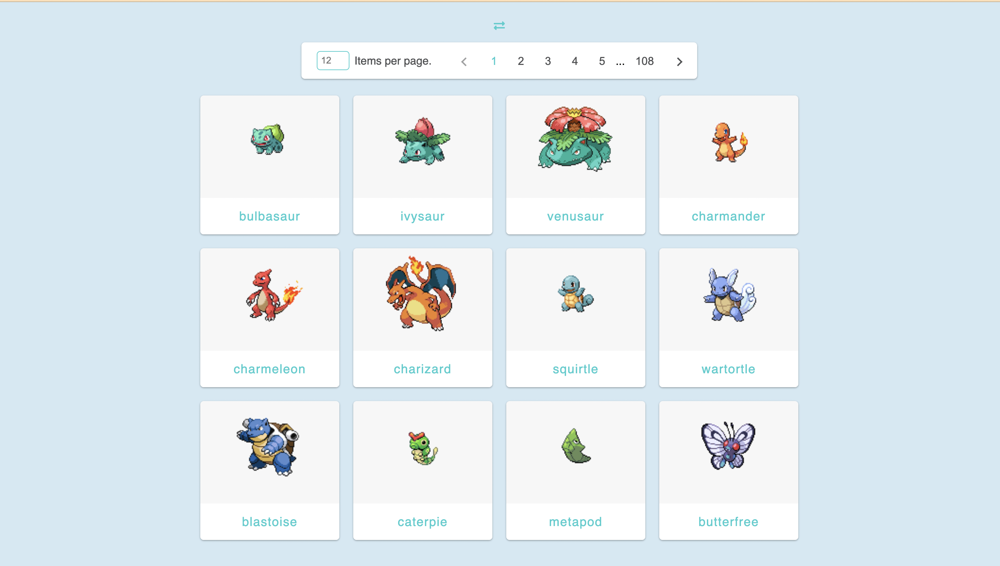
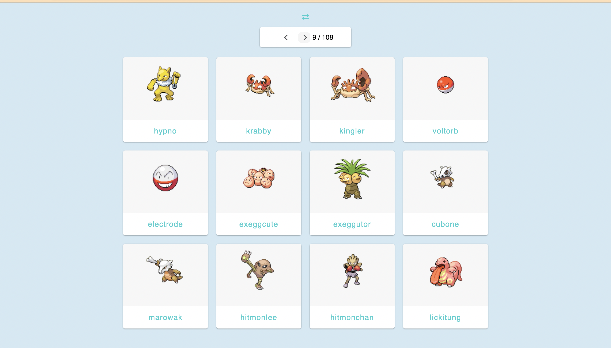
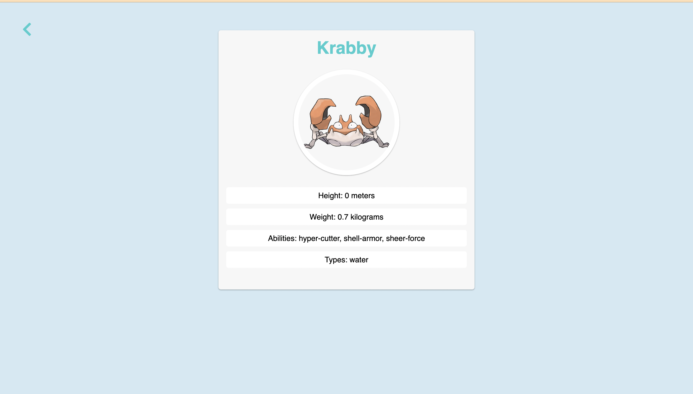

# Poke App - made with love  ^_^

The Poke App is designed to manage and display Pokémon-related data. It utilizes React, TypeScript, and uses `tanane-lib` to create a user-friendly interface for browsing Pokémon details.
:
## Demo:
* Classic pagination:


* Simple navigation:


* Poke details:


---
## Installation:

Clone this repository and navigate to the project directory:

```bash
git clone https://github.com/Arcoders/tanane-app.git
cd tanane-app
npm install 
```

## Usage:
To run the app locally:

```bash
npm run dev 
```

---

## Routing:

The app utilizes React Router for navigation. Here's an overview of the routes:

* Home: / - Renders the Home component with a paginated list of Pokémon.

* PokemonDetail: /:pokeId - Displays detailed information for a specific Pokémon.

---

## Application Structure:

The main application resides in `App.js`, managing routing between two components.
The `Home` component is a landing page displaying a paginated list of Pokémon.

Utilizes `PokemonProvider` for context management.
Includes the `Pagination` component for navigating the Pokémon list.
Utilizes the `PokemonList` component to display the Pokémon list.

---

## Pokemon Service:

Contains methods for listing and finding Pokémon, utilizing the fetchUrl function to make `GET` HTTP requests.
Fetches a list of Pokémon and details for individual Pokémon.


* The `list` method fetches a list of Pokémon based on a given query, retrieving details like name and image for each Pokémon.

* The `find` method fetches details of a specific Pokémon by its name.

---

## Hooks, Components, and Data Management:

A couple of hooks (usePokemonList, usePokemon) are employed for handling Pokémon-related data. These hooks are integral in providing data to the user interface.

---

## Styling:

The SCSS variables maintain consistent styling throughout the app, defining colors, typography, spacing, and other design-related properties.

I utilized Beem for managing classnames.

---

## TypeScript Configuration (tsconfig.json):

The TypeScript configuration file (tsconfig.json) for the project specifies compiler options and settings:

* Target Environment: Sets the target environment to ES2020, enabling certain language features.

* Module Resolution: Configures module resolution to "bundler" mode for better compatibility with bundlers.

* Linting: Enforces strict type checking and various linting rules.

The tsconfig.json file ensures proper compilation, bundling, and strict type checking for the project.

---

## TypeScript Types:

The application uses TypeScript types/interfaces to define the shape of different data structures related to Pokémon. These types include:

* `ErrorResponse`: Represents an error response containing an error object.

* `TPokemonList`: Defines the structure for a list of Pokémon, including count, next and previous URLs, and a list of TResult items.

* `TResult`: Represents an individual Pokémon with a name and URL.

* `TPokemon`: Defines a Pokémon with a name and an image URL.

* `TPokemons`: Represents a collection of Pokémon, including count, a list of 

* `TPokemonInfo`: Defines details about a Pokémon, including its name, image, and sprites.

* `TPokemonDetails`: Represents detailed information about a Pokémon, including abilities, height, weight, etc. It contains nested types like Ability, Sprites, and Type for specific details.


These TypeScript types/interfaces ensure consistent data structures and help maintain type safety throughout the application.

---

## Contributing:

Contributions to the App are welcome! Feel free to submit issues or pull requests.

This is the first approach and iteration, and I'm eager to receive feedback to improve and refine it.